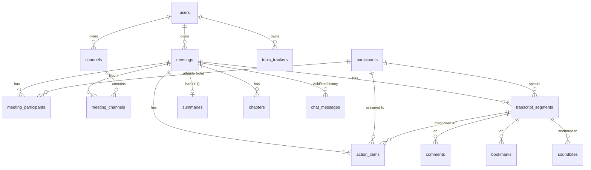

# Fireflies.ai Clone: Meeting Notes & Transcription Platform

A full-stack clone of the [Fireflies.ai](https://fireflies.ai) post-meeting workspace. It includes:

- a meetings library organized into channels
- interactive, speaker-labelled transcripts kept in sync with a media player
- AI summaries, notes, outlines and action items
- Smart Search (AI filters, sentiment, talk time, topic trackers)
- AskFred chat, both for one meeting and across all meetings
- global search, tasks, analytics and dark mode

> 📋 **Requirement-by-requirement coverage, UML diagrams and the evaluation checklist: [`docs/DELIVERABLES.md`](docs/DELIVERABLES.md)**
>
> 🔗 **Live demo:** https://firefliesai-arvin.vercel.app (API: https://fireflies-ai-clone-5iyf.onrender.com — free tier, the first request after idle takes ~30–60 s) · **Repository:** https://github.com/ArvinSaini/Fireflies.ai-Clone
>
> **Stack:** Next.js 16 (TypeScript, App Router, Tailwind v4, TanStack Query) · FastAPI · SQLAlchemy 2 · SQLite (+ FTS5)

The UI was modelled on the **current** Fireflies app. Before any frontend code was written, I studied its 2026 help-center screenshots and product pages. I then compared every page side by side with the live app (a free account, viewed read-only) and matched the differences: the trial banner, the Meetings-page Ask Fred panel, the meeting page's 4-icon rail and tab order, the AskFred start screen and the Plans page. The findings, sampled colors and design decisions are in [`docs/UI_RESEARCH.md`](docs/UI_RESEARCH.md).

---

## Features

| Area | What works |
|---|---|
| **Meetings library** | Meeting cards grouped by day, showing date · time · duration · host and capture-source icons. **Channels** (`#public` / 🔒 private) appear in a second-level panel. Views: *My Meetings* (Hosted by me / Shared with me), *All Meetings* and *Uploads*. **Filters** popover: host, participants, date range, duration, captured-from, channels. Local search by title or participant, sorting, "load more" paging, bulk select → move / delete, per-meeting ⋯ menu (share, copy link, download, move to channel, rename, delete) and a **Details** drawer. A permanent **Ask Fred** panel on the right answers questions across the current scope (My action items · Key decisions · Key initiatives). |
| **Meeting page** | Same layout as Fireflies: a 4-icon left rail (Smart Search open by default, Soundbites, Comments, Bookmarks), notes in the middle, **AskFred | Transcript** tabs on the right. **Transcript:** speaker avatars, clickable timestamps and **click-to-seek**. The playing line highlights and auto-scrolls, with a "Sync with audio" button when you scroll away. **Player:** seek bar with chapter ticks, ±15 s, speed, keyboard shortcuts. **Find in transcript** with highlighted matches and next/previous. Inline transcript editing and speaker re-assignment. Hover toolbar: soundbite, comment, bookmark, copy, link to this moment (`?t=` deep links). |
| **AI notes** | Keywords, overview, timestamped notes sections, action items grouped by assignee (add / edit / assign / complete / delete) and an outline of chapters. Summary "templates", edit and regenerate. |
| **Smart Search** | AI filters (questions, tasks, metrics, dates), sentiment, speaker talk time with WPM, and topic trackers. Each one filters the transcript. |
| **AskFred** | Per-meeting chat with suggested questions, *Attendee Contributions* / *Todos* quick prompts and cited transcript moments. A workspace-wide AskFred page (Fireflies' start screen and starters) answers across all meetings with sources: open action items, last-meeting summary, prep for the next meeting, key decisions, key initiatives, weekly digest, or any free-text question (retrieval over FTS5). |
| **CRUD** | Create meetings by **uploading** (.txt / .vtt / .srt / .json), **pasting** a transcript or a **manual form**. Edit metadata (title, date, language, participants), delete, and full CRUD for action items, channels, comments, soundbites, bookmarks and topic trackers. Everything persists in SQLite. |
| **Everything else** | Ctrl+K global search (SQLite FTS5 with highlighted snippets), Tasks feed (My Tasks / All Tasks), workspace analytics, Plans page (monthly / annual toggle), export (Markdown / TXT / JSON / print-to-PDF), toasts, light and dark themes, responsive layout. |
| **Placeholders** | These show a "Coming soon" dialog: the live meeting bot / Capture, speech-to-text, integrations, team & sharing, AI Skills, Voice Agents, billing and real authentication (a default user is assumed). |

---

## Tech stack

| Layer | Technology |
|---|---|
| Frontend | **Next.js 16** (App Router, TypeScript strict), React 19, **Tailwind CSS v4**, **TanStack Query** (server state + cache invalidation), lucide-react icons, sonner toasts, next-themes (dark mode) |
| Backend | **Python 3.12 + FastAPI**, Pydantic v2 (request/response contracts), pydantic-settings, Uvicorn |
| Database | **SQLite** via **SQLAlchemy 2** (typed `Mapped[]` models, 15 tables) + an **FTS5** full-text index kept in sync by triggers |
| AI | Built-in heuristic engine by default; optional **Claude** (Anthropic SDK) or **Gemini** (REST) with automatic fallback |
| Testing & quality | pytest (43 tests), Playwright end-to-end audit (86 checks), ESLint, Ruff, `tsc --noEmit` |
| Hosting | Frontend on **Vercel**, backend on **Render** (`render.yaml` blueprint) |

---

## Getting started

Prerequisites: **Python 3.12+** and **Node 20+**.

### 1. Backend (FastAPI on :8000)

```bash
cd backend
python -m venv .venv
# Windows: .venv\Scripts\activate    macOS/Linux: source .venv/bin/activate
pip install -r requirements-dev.txt
uvicorn app.main:app --reload --port 8000
```

On first start the app creates `backend/fireflies.db` and **seeds 8 realistic meetings**. Each one has a full transcript, summary, notes, chapters, action items and channels, plus default topic trackers.

- Interactive API docs: http://localhost:8000/docs
- Re-seed from scratch: `python -m app.seed.loader --reset`
- Run the tests: `pytest` (43 tests: parser, AI engines and providers, API end-to-end, error mapping) · lint: `ruff check app tests`

### 2. Frontend (Next.js on :3000)

```bash
cd frontend
cp .env.example .env.local      # NEXT_PUBLIC_API_URL=http://localhost:8000
npm install
npm run dev
```

Open http://localhost:3000.

### Optional: LLM-powered AI (Claude or Gemini)

The app is fully functional without an LLM: a built-in extractive engine produces the summaries, action items and AskFred answers. To use an LLM instead, put a key in `backend/.env`:

- `GEMINI_API_KEY=...` uses Google Gemini, called over its REST API with the standard library (no extra dependency).
- `ANTHROPIC_API_KEY=...` uses Claude through the official SDK.

`AI_PROVIDER=auto` (the default) prefers Claude when both keys are set; set it to `gemini`, `claude` or `heuristic` to force a choice. If the API call fails, is rate-limited or is refused, the app falls back to the built-in engine.

---

## Architecture

```
┌──────────────── Next.js 16 (frontend/) ────────────────┐        ┌──────────── FastAPI (backend/) ─────────────┐
│ app/                route groups → layouts              │  JSON  │ api/routes/   thin HTTP layer (validation,  │
│  (main)/  sidebar shell: Home, Tasks, AskFred, …        │ ─────▶ │               auth dependency, status codes) │
│  (library)/ icon rail + channels: Meetings, Uploads      │  REST  │ api/deps.py   DB session, current user,     │
│  (notepad)/meetings/[id]  meeting page                   │ ◀───── │               ownership checks              │
│ components/  feature folders (meetings, notepad, …)      │        │ services/     use-cases & business logic    │
│ lib/api.ts   typed fetch client                          │        │   meetings · action_items · transcript ·    │
│ lib/queries.ts TanStack Query hooks + cache invalidation │        │   channels · topic_trackers · search ·      │
│ PlayerContext virtual clock ↔ transcript sync            │        │   insights · export · chat · workspace_ai · │
│                                                          │        │   parser · errors · ai/ (heuristic|LLM)     │
└──────────────────────────────────────────────────────────┘        │ models/       SQLAlchemy 2 ORM (15 tables)  │
                                                                     │ schemas/      Pydantic request/response     │
                                                                     │ SQLite + FTS5 virtual table (triggers)      │
                                                                     └─────────────────────────────────────────────┘
```

**Backend layering:**

- **Routers** are thin: they validate input with Pydantic, call one service function and shape the response. No route contains SQL.
- **Services** own the queries, business rules and transactions. They raise **domain errors** (`services/errors.py`: `NotFound`, `Conflict`, `InvalidInput`) and know nothing about HTTP.
- **One exception handler** in `main.py` maps those errors to 404 / 409 / 422, so status codes are consistent across every endpoint.
- **Models** define the schema.
- **Schemas** are the public contract.

Auth is a single dependency (`current_user`) that returns the default user. Real auth would replace only that function.

**AI layer** (`services/ai/`):

- A `Summarizer` / `Assistant` protocol has two implementations:
  - `HeuristicSummarizer` / `HeuristicAssistant`: keyword scoring, extractive sentences and commitment detection ("I'll…", "Marcus, can you…").
  - `LLMSummarizer` / `LLMAssistant`: provider-agnostic prompts, schemas and mapping on top of a small `StructuredLLM` provider interface (`providers.py`):
    - `ClaudeProvider`: structured outputs via `client.messages.parse`.
    - `GeminiProvider`: REST `generateContent` in JSON mode, validated with Pydantic.
- `get_summarizer()` picks the provider from the configured keys and wraps it in a fallback.
- Callers never know which engine ran; it is recorded in `summaries.generated_by`.

**Media player:**

- Real recordings and speech-to-text are out of scope, so meetings without a `media_url` play through a **virtual clock** (`requestAnimationFrame`).
- If a meeting has a `media_url`, the same context drives an `<audio>` element.
- The transcript, notes timestamps, AskFred citations and seek bar all share one `usePlayer()` context. Clicking any timestamp seeks the player, and the playhead highlights and scrolls to the active line (binary search over segment start times).

**Frontend data flow:**

- All server state lives in TanStack Query.
- Mutations go through `useMeetingMutation`, which invalidates the meeting plus the library, stats and tasks caches, so every view stays consistent.
- Next 16 `cacheComponents` is on. Pages render a static shell, and anything that reads URL data sits inside `<Suspense>`.

---

## Database schema



| Table | Key columns | Notes |
|---|---|---|
| `users` | id, name, email (unique), avatar_color | single default user (auth out of scope) |
| `meetings` | owner_id → users, title, started_at, duration_ms, platform, language, media_url, source_filename, source_size_bytes | index `(owner_id, started_at)`; `CHECK duration_ms >= 0` |
| `participants` | name, email (unique, nullable), color | shared across meetings; deduped by email, else name |
| `meeting_participants` | meeting_id, participant_id, **role** (host/attendee) | M:N association with payload; `UNIQUE(meeting_id, participant_id)` |
| `channels` / `meeting_channels` | owner_id, name, is_private, description | M:N; `UNIQUE(owner_id, name)` plus a case-insensitive check in the API |
| `transcript_segments` | meeting_id, participant_id (SET NULL), position, start_ms, end_ms, text | `UNIQUE(meeting_id, position)`, index `(meeting_id, start_ms)`, `CHECK end_ms >= start_ms` |
| `segments_fts` | FTS5 external-content table over `transcript_segments.text` | kept in sync by INSERT/UPDATE/DELETE triggers; porter stemming |
| `summaries` | **meeting_id (PK, FK)**, overview, keywords (JSON), notes (JSON), generated_by | 1:1 with meetings; `notes` is a document rendered as a unit, so JSON instead of rows |
| `chapters` | meeting_id, title, description, start_ms, end_ms | the outline |
| `action_items` | meeting_id, assignee_id → participants, segment_id, text, is_completed, completed_at, due_date, position, source (ai/user) | regenerating the AI notes keeps user-created and completed items |
| `comments`, `bookmarks`, `soundbites` | anchored to a transcript segment (and user) | `soundbites` has `CHECK end_ms > start_ms` |
| `topic_trackers` | owner_id, name, keywords (JSON), color | counted per meeting in Smart Search |
| `chat_messages` | meeting_id, role, content, citations (JSON) | AskFred history per meeting |

Design choices:

- **Times are integer milliseconds**, so there is no float drift.
- **Foreign keys use `ON DELETE CASCADE`**, with `PRAGMA foreign_keys=ON`. Deleting a meeting removes its transcript, summary, items and FTS rows.
- **Deleting a participant or segment never deletes action items**: `SET NULL` keeps the task.
- **Analytics are computed on read** (talk time, filters, sentiment). They are cheap at meeting scale and never go stale after transcript edits.

---

## API overview

Base URL `/api`. The full schema is at `/docs`.

| Method & path | Purpose |
|---|---|
| `GET /meetings` | List with `q, scope=all\|mine\|shared, host_id[], participant_id[], channel_id[], platform[], date_from, date_to, min_duration, max_duration, sort, page, page_size` |
| `POST /meetings` | Create from a form; include `transcript_text` to paste a transcript (auto-summarized) |
| `POST /meetings/upload` | Multipart upload of a `.txt/.vtt/.srt/.json` transcript |
| `GET · PATCH · DELETE /meetings/{id}` | Detail (summary, chapters, action items, participants, channels), update metadata, delete |
| `POST /meetings/bulk` | `{action: delete\|move, meeting_ids, channel_ids}` |
| `GET /meetings/{id}/transcript` | Ordered segments with speakers |
| `GET /meetings/{id}/analytics` | Talk time, AI filters, sentiment, topic-tracker hits |
| `POST /meetings/{id}/summary/regenerate` · `PATCH /meetings/{id}/summary` | Re-run the AI pipeline · edit overview / keywords / notes |
| `GET /meetings/{id}/export?format=md\|txt\|json` | Download notes + transcript |
| `POST /meetings/{id}/action-items` · `PATCH · DELETE /action-items/{id}` · `GET /action-items?mine=&status_filter=` | Action items CRUD + the Tasks feed |
| `PATCH /segments/{id}` | Edit transcript text / re-assign speaker |
| `…/comments`, `…/soundbites`, `…/bookmarks` | Collaboration on transcript moments |
| `GET · POST · DELETE /meetings/{id}/chat` · `GET /meetings/{id}/chat/suggestions` | AskFred for one meeting |
| `POST /askfred` | AskFred across all meetings: intents (action items, last meeting, upcoming, decisions, initiatives, weekly digest) or retrieval + answer with cited sources |
| `GET /search?q=` | Global FTS5 search over titles and transcripts with highlighted snippets |
| `GET · POST · PATCH · DELETE /channels` · `/topic-trackers` | Workspace configuration |
| `GET /me` · `/stats` · `/participants?role=host` · `/health` | Workspace info |

---

## Transcript formats accepted

- **Plain text**: `[00:01:23] Name: text`, `00:01:23 Name: text`, `Name (01:23): text`, `Name: text`, or a speaker header line followed by text lines.
- **WebVTT**: `<v Name>` voice tags or `Name: text` cues. Consecutive short cues from the same speaker are merged.
- **SRT** and **JSON**: a list, or `{segments|transcript|utterances: [...]}` with `speaker`/`start`/`end`/`text`. Times can be seconds, milliseconds or `hh:mm:ss`.

Lines without timestamps get times estimated from word count (~150 wpm).

---

## Deployment

- **Backend → Render**: `render.yaml` is a ready blueprint (root `backend/`, `uvicorn app.main:app`, health check `/api/health`). Set `CORS_ORIGIN_REGEX` to your Vercel domain (the default allows `*.vercel.app`).
- **Frontend → Vercel**: import the repo with **Root Directory `frontend/`** and set `NEXT_PUBLIC_API_URL` to the Render URL.
- SQLite lives on the instance's disk. On free hosting tiers the disk is ephemeral, so the demo **re-seeds automatically** on a fresh start. For lasting data, attach a persistent disk and point `DATABASE_URL` at it.

## Assumptions

- **Single default user** (Arvin Saini, id 1). "Hosted by me" and "My Tasks" resolve the user's participant record by email.
- **No real audio or speech-to-text.** Transcripts are seeded, uploaded or pasted, and playback is simulated, which keeps transcript/player sync fully functional.
- **AI notes are generated locally by default** (deterministic and offline), or by Claude or Gemini when a key is set. Seed meetings ship with hand-written notes.
- **Channel membership is many-to-many.** "Move to channel" replaces a meeting's channel set.
- **Global AskFred is stateless on the server.** Recent chats are kept in the browser's localStorage. Per-meeting AskFred history is stored in the database.

## Project structure

```
backend/
  app/
    api/            deps.py, presenters.py, routes/ (meetings, channels, action_items, transcript, assistant, askfred, …)
    core/config.py  pydantic-settings
    models/         SQLAlchemy models
    schemas/        Pydantic models
    services/       meetings, action_items, transcript, channels, topic_trackers, people, search, insights,
                    export, chat, workspace_assistant, transcript_parser, errors, ai/
    seed/           loader.py + data/*.json (8 meetings)
  tests/            pytest: parser, AI engines/providers, API, error mapping
frontend/
  src/app/          (main) · (library) · (notepad) route groups
  src/components/   layout, meetings, notepad, askfred, tasks, analytics, settings, ui
  src/lib/          api client, query hooks, formatting, hooks
docs/UI_RESEARCH.md research on the current Fireflies UI
```
