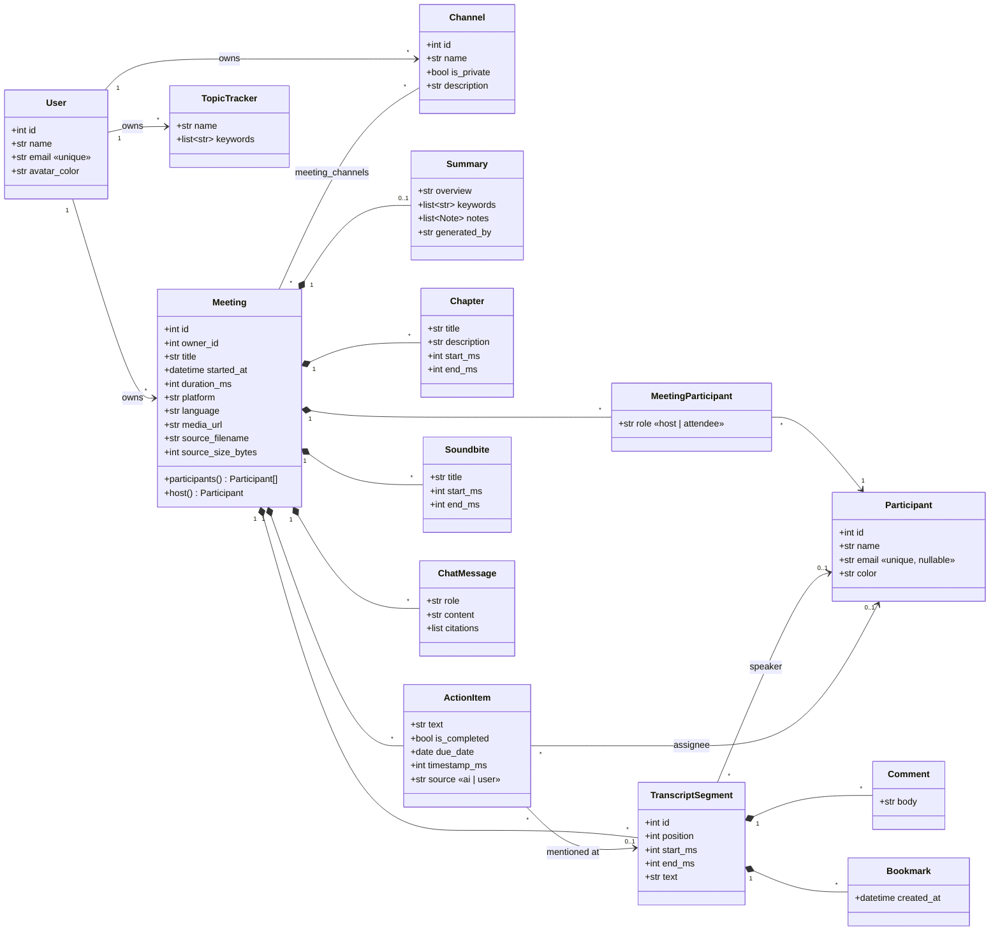
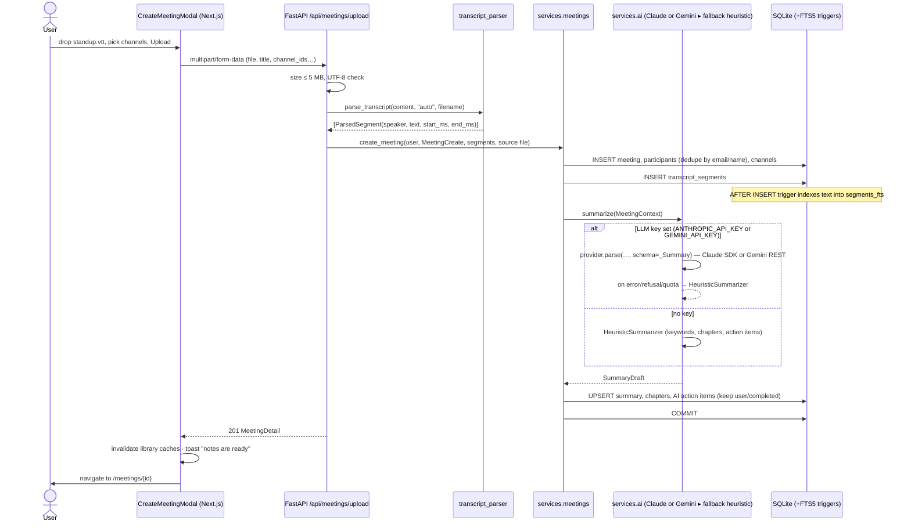
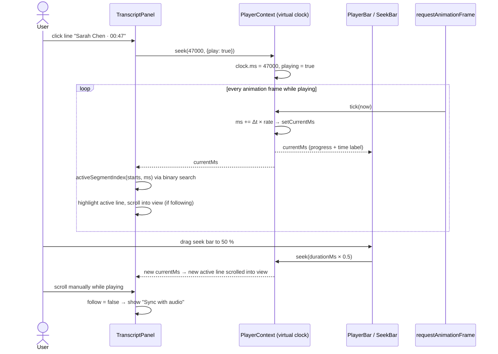
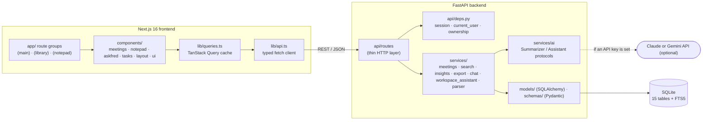

# Deliverables & Requirements Coverage

This document checks the assignment brief line by line against what was built, shows where each item lives, and
explains how to verify it. The README covers setup; this document is the evaluation companion.

- **Repository:** https://github.com/ArvinSaini/Fireflies.ai-Clone (`frontend/` + `backend/`)
- **Live demo:** _added after deployment_ (backend on Render via `render.yaml`, frontend on Vercel)
- **Docs:** [`README.md`](../README.md) (setup, stack, architecture, schema, API, assumptions) ·
  [`docs/UI_RESEARCH.md`](UI_RESEARCH.md) (study of the current Fireflies UI) · this file

Legend: ✅ done · 🟡 placeholder by design (allowed by the brief)

---

## 1. Core features (must have)

### 1.1 Meetings library / dashboard

| Requirement | Status | Implementation | How to verify |
|---|---|---|---|
| List of past meetings with **title, date, duration, participants** | ✅ | `components/meetings/MeetingCard.tsx`: title, `Oct 8 · 3:00 PM · 12 min · host`, a participant avatar stack + names, channels | Open `/meetings` |
| **Search** meetings | ✅ | Local search box (title or participant name/email), `GET /api/meetings?q=`; plus Ctrl+K global search | Click 🔍 on `/meetings`, type "marcus" |
| **Filter** by title, **date**, **participant** | ✅ | `FiltersPopover.tsx` (two-pane, like Fireflies): Hosted by · Participants · Date range (Today / 7 / 14 / 30 days / custom) · Duration · Captured from · Channels. Backend: `services/meetings.py::_apply_filters` | Filters → Participants → Priya |
| **Sort by recency** | ✅ | Sort menu: Newest / Oldest / Longest / Shortest / Title (`sort=` param); grouped by day | "Newest first" button |
| **Navbar with profile/settings placeholders** | ✅ | Workspace/profile menu (Settings, dark mode, Sign out 🟡), Settings page, bell, Invite 🟡, Capture | Click "Arvin Saini ▾" |
| Extra | ✅ | Channels panel, *Hosted by me / Shared with me*, bulk select → Move / Delete, ⋯ menu, Details drawer, Uploads view, paging | — |

### 1.2 Meeting / transcript detail view

| Requirement | Status | Implementation | How to verify |
|---|---|---|---|
| Interactive transcript with **speaker labels and timestamps** | ✅ | `notepad/TranscriptPanel.tsx`: avatar, speaker ▾ (re-assign), blue timestamp | `/meetings/1` |
| **Media player with a seek bar** | ✅ | `notepad/PlayerBar.tsx`: drag/click seek track with chapter ticks and a hover time, play/pause, ±15 s, speed 0.5–2×, keyboard (Space, Alt+←/→). `PlayerContext.tsx` uses a virtual clock (placeholder media allowed) or `<audio>` when `media_url` is set | Press ▶, drag the bar |
| **Click a line → player seeks** (and **vice versa**) | ✅ | Line click → `seek(start_ms)`; the playhead highlights the active line (binary search) and auto-scrolls; "Sync with audio" appears after a manual scroll | Click any line; drag the seek bar and watch the highlight move |
| **Search within the transcript with highlighted matches** | ✅ | "Find in transcript": `<mark>` highlights, `3 / 12` counter, ↑/↓ and Enter / Shift+Enter navigation, current match in orange | Type "SSO" |

### 1.3 AI summary & notes

| Requirement | Status | Implementation |
|---|---|---|
| AI-generated **summary** | ✅ | Keywords + overview (`SummaryColumn.tsx`); generated by `services/ai/` (heuristic by default, or Claude / Gemini when an API key is set); "Refine Summary" regenerates; editable |
| **Action items / tasks** extracted | ✅ | Commitment detection ("I'll…", "Marcus, can you…", "we need to…") with assignee + source timestamp; grouped by assignee like Fireflies |
| **Key topics / outline / chapters** | ✅ | Emoji notes sections with timestamps, plus an Outline (chapters with time ranges, clickable) and an Index panel |
| Seeded / mocked / LLM-generated | ✅ | Seed meetings ship hand-written notes; new uploads go through the AI pipeline; Claude or Gemini is optional |

### 1.4 Meeting management (CRUD)

| Requirement | Status | Implementation | Endpoint |
|---|---|---|---|
| **Create** by uploading a transcript | ✅ | Capture ▾ → Upload (drag & drop .txt/.vtt/.srt/.json) | `POST /api/meetings/upload` |
| **Create** by pasting a transcript | ✅ | Capture ▾ → Paste ("Use a sample" helper) | `POST /api/meetings` with `transcript_text` |
| **Create** via a form | ✅ | Capture ▾ → Manual (title, date, duration, participants, channels) | `POST /api/meetings` |
| **Edit metadata (title, participants)** | ✅ | ⋯ → "Rename / edit details" (title, date, language, add/remove participants) | `PATCH /api/meetings/{id}` |
| **Delete** a meeting | ✅ | ⋯ → Delete (with confirmation), plus bulk delete | `DELETE /api/meetings/{id}`, `POST /api/meetings/bulk` |
| **Add / edit / complete action items** | ✅ | Inline add, click to edit, checkbox, assign, delete (meeting page and Tasks page) | `POST /meetings/{id}/action-items`, `PATCH`/`DELETE /action-items/{id}` |
| **Everything persists** | ✅ | SQLite (`backend/fireflies.db`); FK cascades; FTS index kept in sync by triggers | — |

### 1.5 Fireflies experience

| Requirement | Status | Implementation |
|---|---|---|
| Navigation & layout (library + detail) | ✅ | Route groups: `(main)` expanded sidebar · `(library)` icon rail + channels panel · `(notepad)` full-width meeting page; all researched from current Fireflies screenshots |
| Transcript & summary panels | ✅ | Notes / AI Skills tabs; Transcript / AskFred tabs; left rail with Smart Search · Index · Soundbites · Comments · Bookmarks |
| Forms, modals, search, filters | ✅ | Create-meeting dialog, edit dialog, move-to-channel, confirm dialogs, Ctrl+K palette, filters popover |
| Notifications / toasts | ✅ | `sonner` toasts on every mutation; notifications bell |
| Settings placeholders | ✅ | `/settings`: Profile · Appearance (works) · Notetaker 🟡 · Channels (works) · Topic Trackers (works) · Billing 🟡 · API 🟡 |

## 2. Mocked / placeholder sections (allowed)

| Item | How it's handled |
|---|---|
| Real-time bot that joins calls | 🟡 "Capture" button → Coming soon dialog; Settings → Notetaker toggles |
| Actual speech-to-text | 🟡 Transcripts are seeded, uploaded or pasted; playback uses a virtual clock |
| Integrations (Zoom, Meet, calendar, CRM) | 🟡 `/integrations` catalog + meeting-page "send to apps" menu → Coming soon |
| Team / sharing | 🟡 Invite / Create Team / Share → Coming soon ("Copy link" works) |
| Real authentication | 🟡 Single default user via the `current_user` dependency (one function to swap) |

## 3. Bonus features (all done)

| Bonus | Status | Implementation |
|---|---|---|
| Comments / highlights / **soundbites** on transcript segments | ✅ | Hover toolbar on each line → comment, bookmark, Create Soundbite; panels list them (`comments`, `bookmarks`, `soundbites` tables) |
| **Export** transcript or summary (PDF / Markdown / TXT) | ✅ | Player ⤓ menu: `.md`, `.txt`, `.json` (`GET /meetings/{id}/export`) and **PDF** via a print-ready document (`/meetings/{id}/print`) |
| **Global search** across all meetings | ✅ | Ctrl+K palette using SQLite **FTS5** (porter stemming, prefix match, highlighted snippets); results deep-link to the exact moment (`?t=`) |
| **Tags / topics** and filtering | ✅ | **Channels** (# / 🔒, Fireflies' equivalent of tags) with filtering, plus **Topic Trackers** (keyword groups counted per meeting) |
| LLM-powered **"ask a question about this meeting"** | ✅ | AskFred tab (suggested questions, citations that seek the player) **and** workspace-wide AskFred (`/askfred`); Claude or Gemini when a key is set, retrieval-based engine otherwise |
| **Dark mode** | ✅ | Token-based theme (`globals.css`), toggle in the profile menu and Settings → Appearance |
| Extra (not asked) | ✅ | Smart Search (AI filters, sentiment, speaker talk time + WPM), Tasks feed, Analytics, transcript editing & speaker re-assignment, mobile layout |

## 4. Important notes from the brief

| Note | How it's met |
|---|---|
| UI should resemble Fireflies closely; study it first | Researched Feb–Jul 2026 help-center screenshots + the homepage with Playwright before building; colors sampled from pixels (`#6938EF`, Untitled-UI grays). See `docs/UI_RESEARCH.md` |
| Seed several meetings with full transcripts, summaries, action items | 8 meetings (45–64 lines each), each with summary, notes, chapters and 5–6 action items, channels, a sample comment/soundbite, 3 topic trackers; auto-seeded on first start |
| Design your own schema (evaluated) | 15 tables + an FTS5 index; see §6 and the README schema section |
| README: setup, tech stack, architecture, schema, assumptions | `README.md` (also covers API and deployment) |
| Original work | Written from scratch for this assignment; no code copied from existing clone repos |

## 5. Deliverables checklist

| Deliverable | Status |
|---|---|
| Public GitHub repo with `frontend/` and `backend/` | ✅ structure ready, commits authored by Arvin Saini; **push pending your go-ahead** |
| README with setup, architecture, schema, API overview | ✅ `README.md` |
| Hosted working link | ⏳ configs ready (`render.yaml`, `.env.example` files); deploy needs your Render/Vercel accounts |

---

## 6. UML diagrams

### 6.1 Class diagram: domain model (database schema)

Composition (◆) means the child is deleted with the meeting (`ON DELETE CASCADE`). Plain associations to `Participant`
use `ON DELETE SET NULL`, so removing a person never deletes their tasks or transcript lines.

### 6.2 Sequence diagram: uploading a transcript (create → parse → AI → persist)

### 6.3 Sequence diagram: transcript ↔ player synchronization (frontend)

### 6.4 Component diagram: architecture

---

## 7. Evaluation criteria → evidence

| Criterion | Evidence |
|---|---|
| **Functionality** | Every must-have item in §1 works end to end. Interactive transcript ↔ player sync, find-with-highlights, AI summary/notes/outline/action items, full CRUD (verified in §8). |
| **UI/UX** | Layout, wording and colors taken from the *current* Fireflies app (§4, `UI_RESEARCH.md`): sidebar/rail/channels, cards grouped by day, two-pane filters, Notepad with left rail panels, Transcript/AskFred tabs, purple pill player, square avatars, blue underlined timestamps. Loading skeletons, empty states, toasts, keyboard shortcuts, dark mode, mobile layout. |
| **Database design** | Normalized 3NF core; M:N with payload (`meeting_participants.role`); 1:1 summary keyed by `meeting_id`; integer-ms times; `CHECK` constraints (time order, non-negative duration); unique constraints (segment position, participant per meeting, channel name per owner, bookmark per user); composite indexes for the hot queries (`owner_id, started_at`), (`meeting_id, start_ms`); cascade vs set-null chosen per relation; FTS5 external-content index maintained by triggers; JSON only for render-as-a-unit documents (notes, keywords, citations). |
| **Backend / API design** | Resource-oriented REST (`/meetings`, `/meetings/{id}/transcript`, `/action-items/{id}`, `/channels`…), correct status codes (201/204/404/409/413/422), Pydantic validation on every input, pagination and filter params, ownership checks in dependencies, a bulk endpoint, OpenAPI docs at `/docs`. Layered: routes → services → models; AI behind protocols with graceful fallback. |
| **Code quality** | TypeScript strict + ESLint (Next + React hooks rules) clean with no suppressions; Python linted with Ruff (pyflakes, bugbear, isort, pyupgrade); `next build` clean; 41 pytest tests; small focused modules; comments explain *why* (e.g. reset-during-render, client-only values, FTS triggers). |
| **Modularity** | Backend: parser, AI engines, search, insights, export and chat are independent services. Frontend: feature folders, shared UI primitives (`ui/`), one typed API client, central query keys and invalidation (`useMeetingMutation`), shared player/notepad contexts. |
| **Code understanding** | The diagrams above plus the README architecture section describe every flow; each module opens with a docstring stating its responsibility. |

## 8. Verification performed

| Check | Result |
|---|---|
| `pytest` (parser formats, AI extraction, API: CRUD, filters, FTS search + triggers, bulk, channels, Smart Search, bookmarks, AskFred) | **41 passed** |
| `tsc --noEmit` · `eslint src` · `ruff check` (backend) | 0 errors · 0 warnings · no lint suppressions in the frontend |
| `next build` (production) | ✅ all routes build (static + partial prerender) |
| Playwright: click line → seek & play; seek bar → active line; find "SSO" → 7 highlighted marks, "1 / 7"; Smart Search "Questions" filter | ✅ |
| Playwright CRUD: paste transcript → AI notes → add/complete/delete action item → rename → AskFred answer → delete meeting | ✅ |
| Playwright: dark mode, 390 px mobile, PDF export (A4 PDF generated from the print view) | ✅ |
| **Full site audit** (Playwright, visible browser, production build): 73 checks covering every core requirement, global-search jump to the exact moment, CRUD with reload-persistence, placeholders, all 6 bonuses, every page and control (home tabs, AskFred page, notifications, channels, bulk move, details drawer, player speed/skip/keyboard, summary templates, summary edit + regenerate, transcript edit + speaker re-assignment, all rail panels, Smart Search filters, topic trackers, tasks, analytics, settings, integrations, upgrade, 404) and 16 responsive checks (390 / 768 / 1024 / 1440 px × 4 pages, no horizontal overflow) | ✅ **73/73**, 0 unexpected console errors |

## 9. Five-minute demo script (for the evaluator)

1. **Home** (`/`): greeting, assistant cards, Recent / AI Feed. Press **Ctrl+K** and search "SSO" to jump to the exact transcript moment.
2. **Meetings**: use Filters → Participants, try *Hosted by me*, open a channel, hover a card for **Details** and ⋯, then bulk-select and move.
3. Open **Q4 Product Roadmap Planning**: press ▶, click transcript lines, drag the seek bar, and use **Find** "SSO".
4. Open **Smart Search** → Questions / Sentiment / Talk time / Topic Trackers.
5. Action items: add, assign, complete. Then **Refine Summary**, Edit, and Export (MD / TXT / PDF).
6. Ask **AskFred** "What decisions were made?" and click a citation.
7. **Capture ▾ → Paste transcript → Use a sample** to create a meeting; rename it and delete it.
8. Visit **Tasks** (My / All), **AskFred** (across meetings), **Analytics**, and **Settings** → Appearance → Dark.

## 10. Known limitations

- No real audio or speech-to-text (out of scope); playback is simulated so the sync behaviour is fully demonstrable.
- The built-in AI engine is extractive (it selects real transcript sentences); set `GEMINI_API_KEY` or `ANTHROPIC_API_KEY` for abstractive LLM summaries.
- Single user by design; data isolation already filters by `owner_id`, so multi-user only needs real auth in `current_user`.
- SQLite on free hosting tiers resets on redeploy; the demo re-seeds automatically.
